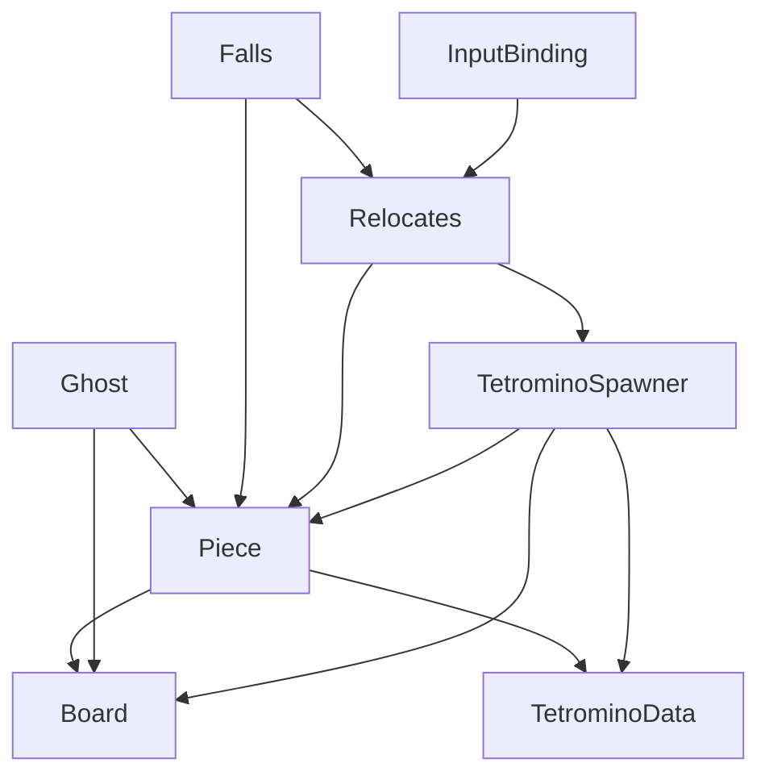

# Goal

Try to reproduce an old version of Tetris that cascades blocks.

# Play

Playable in web browser at https://Feddas.github.io/Tetris/

| Key | Control description |
|---|---|
| E or 🠝 | Rotate clockwise 90° |
| Q | Rotate counter clockwise 90° |
| A or 🠜 | Move to the left |
| D or 🠞 | Move to the right |
| S or 🠟 | Move down |
|Space | Hard drop |

# Design roots

A heavy refactor of a, [well](https://tetris.fandom.com/wiki/SRS) [researched](https://en.wikipedia.org/wiki/Tetromino) but poorly architected, [existing tetris repository](https://github.com/zigurous/unity-tetris-tutorial). The refactor in this repository makes the code more SOLID and gameobjects adhere to a better composition pattern. Making it easier to try out different ideas.

# Architecture

# Colors

[_Tetris/ColorPalette](Assets/_Tetris/ColorPalette) is a standalone tool that extracts from [Unity Color Picker](https://youtu.be/Ihe_ND194q0) via [paletteExtractor.cs](https://gist.github.com/vicot/0c5e9839bebba9436dfc543eda790bd1). The extracted palette isn't used at runtime and should be deleted. Yet, it was a cool distraction that I want to leave it in for reference. An alternative is [swatchr](https://github.com/jknightdoeswork/swatchr).

# Repositories

GitHub: http://github.com/Feddas/Tetris